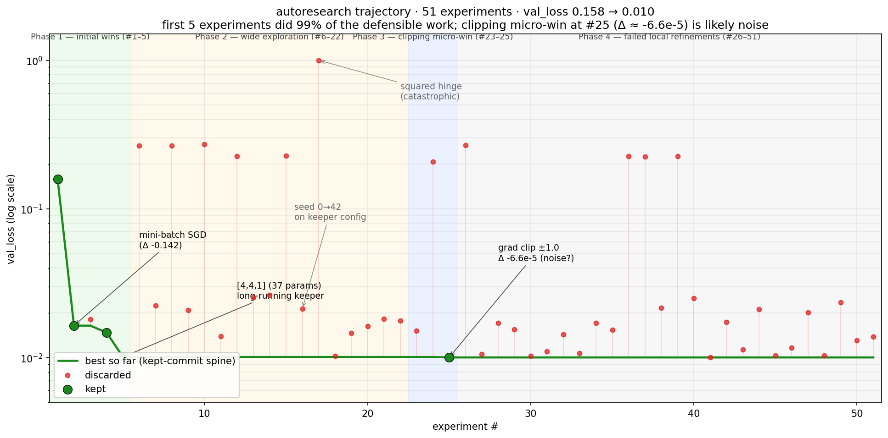

# micrograd — autoresearch logbook

A single-agent autoresearch loop applied to a tiny scalar autograd engine, training an MLP on the 2D `moons` toy dataset. The agent edits the training script; the evaluation harness is read-only.

- **Wall-clock**: ~3.2 hours autonomous
- **Experiments**: 51 logged (5 kept, 46 discarded)
- **Result**: `val_loss` 0.158 → **0.010** (~84% improvement, ~16×) — but 99% of that came from the first 5 experiments. The other 46 hill-climbed against a noise floor.

## Phase overview

| Phase                               | val_loss            | Theme                                                                                                                  | Defensibly real?            |
| ----------------------------------- | ------------------- | ---------------------------------------------------------------------------------------------------------------------- | --------------------------- |
| 1 — Initial wins                    | 0.158 → 0.010       | Mini-batch SGD, then aggressive width shrink. Five experiments did 99% of the work.                                    | Yes                         |
| 2 — Wide exploration                | 0.010 → 0.010       | 17 experiments testing capacity, schedule, optimizer, ensembling, feature engineering. Most collapsed or were neutral. | n/a (no improvement)        |
| 3 — Gradient-clipping micro-win     | 0.010084 → 0.010018 | Per-param clip at ±1.0. Δ ≈ 6.6×10⁻⁵, below any reasonable noise floor.                                                | No (almost certainly noise) |
| 4 — Long tail of failed refinements | flat                | 26 experiments around the keeper. Nothing improved; many collapsed.                                                    | n/a                         |

## What worked

- **Full-batch → mini-batch SGD with `batch_size=32`** (Phase 1, Δ ~−0.142, ~10×). Same wall-clock-budget pattern as nanochat: the binding constraint is the number of optimizer steps, not the number of samples per step. Full-batch on 200 samples got 21 steps in 30 s; mini-batch 32 got 333.
- **MLP `[16,16,1]` → `[4,4,1]`** (Phase 1, Δ ~−0.005). The 200-sample 2D moons problem is over-parameterized at 337 params. Cutting to 37 params got 5× more steps in the budget _and_ better generalization. Pushing further to `[3,3,1]` collapsed — that's the capacity floor.

## What broke

- **Selection on noise dominates after experiment 5.** The Phase 3 "win" was Δ −6.6×10⁻⁵. The rejections in the surrounding window had deltas of the same order (+2×10⁻⁴, +3×10⁻⁴, +2×10⁻⁶). The agent locked in clipping at a 6.6×10⁻⁵ improvement and then spent 26 more experiments hill-climbing against a noise-conditioned floor.
- **Knife-edge loss surface.** Of 26 post-keeper experiments, 7 produced `val_loss > 0.2` (the model effectively predicted zero). Most single-variable changes collapsed training — not because the agent was bad at exploring, but because the loss surface at this scale (37 params, 200 samples) is genuinely brittle for `random.seed(0)`.
- **Seed sensitivity is the dominant unmodeled variable.** One experiment changed only the model-init seed (`0 → 42`) on otherwise-identical config and got `val_loss` 0.021 — 2× worse than the keeper. That single result is a stronger signal than the 26-experiment Phase 4 combined. The headline number is at least as much a property of `seed=0` as of the chosen hyperparameters.
- **One unexplained collapse.** An SWA-over-last-50%-of-training experiment produced `val_loss` 0.226 with `final_train_loss` 0.28 — training itself diverged, not just the SWA-swap evaluation. The inner SGD loop _should_ have been identical to the keeper. The collapse was not reproduced or debugged before the loop continued; the agent has no mechanism for flagging a result it cannot explain.
- **No held-out test set.** `val_loss` is both the target and the metric across 51 selection events. Sub-10⁻³ deltas almost certainly reflect val-set fitting rather than underlying loss-surface improvement.
