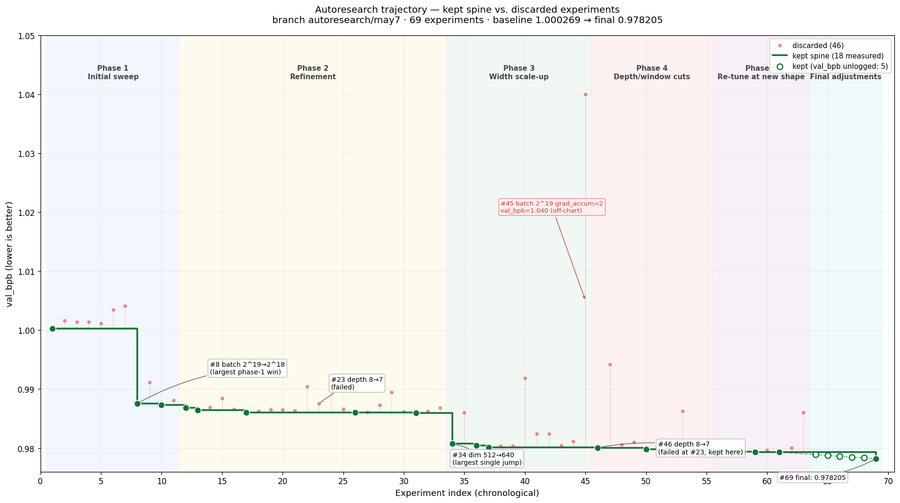

# nanochat — autoresearch logbook

A single-agent autoresearch loop applied to a single-GPU GPT pretraining setup with a fixed 5-minute training budget per experiment. The agent edits `train.py`; `prepare.py` is read-only.

- **Wall-clock**: ~8.5 hours autonomous
- **Experiments**: 63 logged (17 kept, 46 discarded) + 6 unlogged keeps = 69 total
- **Result**: `val_bpb` 1.000 → **0.978** (~2.2% nominal improvement; some real, some not — see below)

## Phase overview

| Phase                     | val_bpb        | Theme                                                                                                     | Defensibly real?          |
| ------------------------- | -------------- | --------------------------------------------------------------------------------------------------------- | ------------------------- |
| 1 — Initial sweep         | 1.000 → 0.987  | Generic LR sweep failed; **halving the batch** (more steps in the same wall-clock) was the first real win | Partly                    |
| 2 — Refinement            | 0.987 → 0.986  | Optimizer re-tuning at the new step regime; 22 attempts for ~0.0016                                       | Marginal                  |
| 3 — Width scale-up        | 0.986 → 0.980  | Embedding dim 512 → 640. **Single largest improvement of the run**                                        | Yes                       |
| 4 — Depth and window cuts | 0.980 → 0.9798 | Dropped a layer, shortened window cycle, freeing compute for more steps                                   | Yes                       |
| 5 — Re-tune at new shape  | 0.980 → 0.979  | Sweep LRs and betas at new architecture                                                                   | Partly noise              |
| 6 — Final adjustments     | 0.979 → 0.978  | Small tunes; logging stopped mid-phase                                                                    | Partly noise; unauditable |

## What worked

- **`total_batch 2^19 → 2^18`** (Phase 1, Δ ~−0.013). The training budget is wall-clock-limited, so the binding constraint is the _number of optimizer steps_, not the _number of tokens per step_. Halving the batch doubles the step count in the same five-minute budget. This insight underlies most of the rest of the run.
- **Width scale-up to dim 640** (Phase 3, Δ ~−0.005). The largest single jump. The model was below the compute-optimal frontier on width; going further to dim 768 crossed back over.

Phase 4's changes (depth 8 → 7, window pattern `SSSL → SSL`) are also plausibly real — each frees per-step compute that buys additional optimizer steps — but the resulting deltas (~0.0004 and ~0.0002) sit right at the borderline of what could be confidently distinguished from noise without replication.

## What broke

- **Selection on noise.** The decision rule is "any improvement over the current best," with no variance estimate. Phase 5 includes several keeps inside the likely noise band (Δ in the −3×10⁻⁵ to −1×10⁻⁴ range). The same problem operates on the discard side: rejected experiments at +0.0002 might be real wins that drew an unlucky sample.
- **Coordinate-descent miss.** Depth 8 → 7 was discarded at dim 512 (Phase 2), then _kept_ at dim 640 (Phase 4). The actual local optimum is the pair `(width=640, depth=7)` — the agent only found it by lucky ordering. There was no factorial test of the interaction.
- **22-attempt stall in Phase 2.** Cumulative gain of ~0.0016 across 22 experiments before Phase 3's structural breakthrough — the textbook symptom of being stuck against a local optimum on a single knob. The `program.md` actively discourages backtracking, which preserves the greedy behavior.
- **Adaptive overfitting.** No held-out test set. `val_bpb` is both the optimization target and the evaluation metric across 64+ selection events. Some unknown fraction of the 0.022 gain is the agent following the val set's particular sample realization rather than the underlying loss surface.
- **Process degradation in Phase 6.** The agent stopped updating `results.tsv` after about 14:39 UTC. Kept commits survive in `git log`; discards in the final 2.5 hours were `git reset` out and never written down. The hit rate and decisions in this period are **unauditable** — a soft indicator of state drift over an eight-hour autonomous run.
