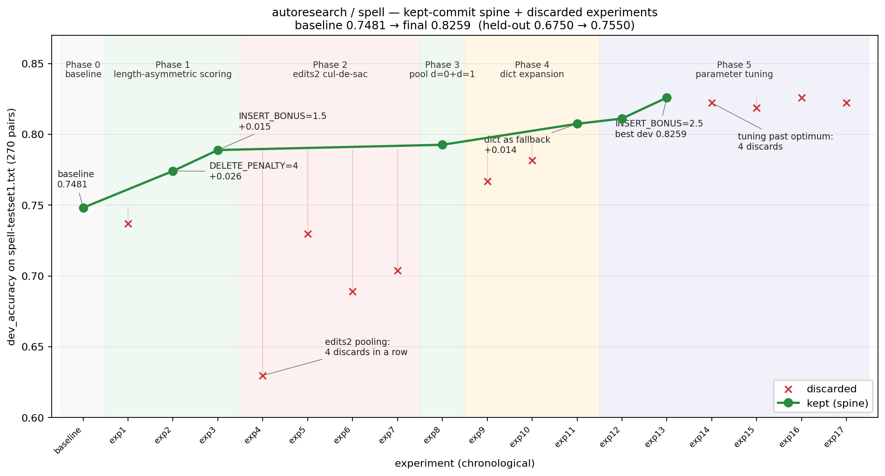

# Spelling corrector — autoresearch logbook

A single-agent autoresearch loop applied to Peter Norvig's spelling corrector. The agent edits `spell.py`; a read-only harness evaluates `dev_accuracy` on `spell-testset1.txt` and reports a held-out `final_accuracy` on `spell-testset2.txt`.

- **Wall-clock**: ~45 minutes, interactive (user paced and stopped the run)
- **Experiments**: 17 attempts + baseline = 18; 7 kept, 11 discarded
- **Result**: `dev_accuracy` 0.748 → **0.826** (+7.8 pts), `final_accuracy` 0.675 → 0.755 (+8.0 pts) — dev and held-out moved roughly in lockstep, which is the main reassurance against adaptive overfitting

## Phase overview

| Phase                         | dev_accuracy        | Theme                                                                     | Defensibly real?      |
| ----------------------------- | ------------------- | ------------------------------------------------------------------------- | --------------------- |
| 1 — Length-asymmetric scoring | 0.748 → 0.789       | Most typos drop letters → penalize shorter candidates, prefer longer ones | Yes                   |
| 2 — Edits2 pooling            | 0.789 (no movement) | Four attempts to make d=2 candidates competitive; pool got noisy          | No (4 in a row)       |
| 3 — Pool d=0 with d=1         | 0.789 → 0.793       | Let rare-but-correct inputs lose to common edits                          | Borderline (~1 item)  |
| 4 — Vocabulary expansion      | 0.793 → 0.807       | `/usr/share/dict/words` as a fallback for OOV cases                       | Yes                   |
| 5 — Parameter tuning          | 0.807 → 0.826       | Sweep `INSERT_BONUS` / `DELETE_PENALTY` at the new design                 | Partly; tail is noise |

## What worked

- **`DELETE_PENALTY = 4.0`** (Phase 1, +0.026 dev / +0.017 final). In the baseline, when `edits1` returned multiple in-dictionary candidates, the most frequent won — which often picked a shorter word (`ther`→`the`, `ment`→`men`). Penalizing strictly-shorter candidates fixed about seven dev cases on the first try.
- **`INSERT_BONUS = 1.5`** (Phase 1, +0.015 dev / +0.020 final). Symmetric counterpart: most testset typos are missing-letter errors, so the corrector should prefer length-increasing candidates when the frequency advantage is modest.
- **`/usr/share/dict/words` as a fallback** (Phase 4, +0.014 dev / +0.025 final). ~15 of the remaining errors had a ground-truth word missing from `big.txt` entirely. Merging the system word list directly into `WORDS` regressed dev (low-frequency dict candidates flooded `edits1`); consulting it only when the primary pool was empty captured the OOV gain without disturbing the in-dictionary case.

The Phase-5 `INSERT_BONUS` walk (1.5 → 2.0 → 2.5) added another ~0.018 dev; pushing to 3.0 over-rotated and was discarded. Held-out `final_accuracy` rose monotonically through the walk.

## What broke

- **Quantization-level keeps.** The dev metric is quantized at `1/270 ≈ 0.0037` — exactly one testset item. Several keeps and discards in this run sit at the quantum (e.g. one keep at Δ +0.0037, two discards at Δ −0.0037). Without replication, any single-item delta is indistinguishable from "which item happened to flip."
- **Greedy stuck spell.** Phase 2 burned four consecutive attempts on the same idea (`edits2` pooling with different penalties and filters) before the agent pivoted. Compare Phase 4's clean three-experiment arc, which redesigned the _integration strategy_ after each failure instead of tuning the same knob — that's the clearest within-run example of the right vs wrong way to react to a discard.
- **No held-out gating.** `final_accuracy` is reported on every run but never used in the keep/discard rule. The agent benefited from that signal post-hoc — joint dev+held-out movement is the main reason to trust the headline — but a loop design that incorporated held-out as a sanity check would have caught the exp9 near-miss (full dict merge: dev regressed 0.026 while final _improved_ 0.055).
- **No re-validation of kept commits.** Once accepted, no kept commit was re-run. Phase 5's small-delta keeps are built on unverified floors.
- **No stop criterion.** The last four attempts were all discards past the knee. The user pressed stop; the agent did not.
